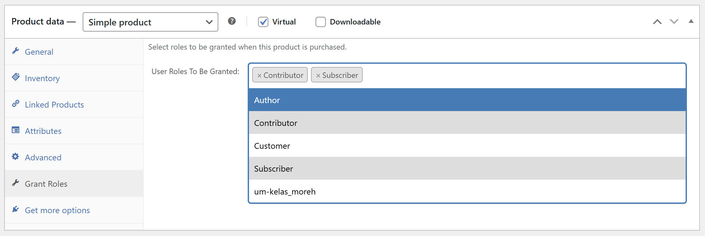

# WOOP Customer Roles WooCommerce Plugin

A WooCommerce / WordPress plugin that grants roles to customers upon purchase of a specific product.

## Motivation

Fair disclosure, I think I built this some time ago with the help of AI.

The reason I made this is because I sell online courses on my WooCommerce setup. I have [Ultimate Member](https://ultimatemember.com/) plugin set up. With that, I can control access to posts and pages based on the user's roles. The free version already allows you to do this.

So I make a new role for each new online course I have. And that is what I use to restrict access to the online course pages.

Now I can create a product in WooCommerce, link it with the specific roles, and when the customer buys that product, the right roles will be granted.

With that, the customer will gain access to the restricted posts and pages.

## How to Install & Use

1. Just like any other WordPress plugin, download and extract the **woop-customer-roles** folder into your **wp-plugin** folder. _Use the green **Code** button and then look for th **Download ZIP**_
2. Head back to your WordPress Dashboard and proceed to the Plugins page.
3. Find and activate **Woop Customer Roles**
4. How head to the Products page. 
5. Click to Edit any of your product
6. You will find a new tab for that product labelled **Grant Roles**

